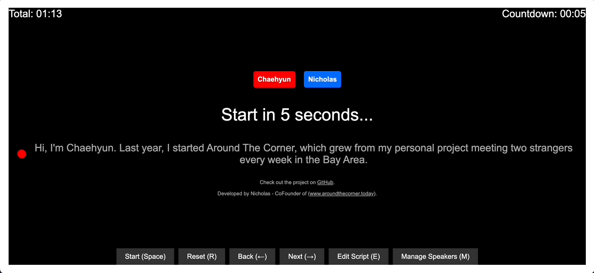

# YC Prompter

YC Prompter is an open-source web-based teleprompter application designed to help founders create their Y Combinator (YC) application videos. This tool provides a user-friendly interface for scripting, timing, and presenting your pitch with ease, all within your web browser.

## Features

- Browser-based teleprompter accessible at ycprompter.com
- Script editing and management
- Multi-speaker support with color coding
- Countdown timer and segment timing
- Keyboard shortcuts for easy control
- Local storage for saving scripts and settings on your device

## Getting Started

1. Navigate to [ycprompter.com](https://ycprompter.com) in a modern web browser.
2. Use the "Edit Script" button to input your presentation script.
3. Press "Start" or use the spacebar to begin the teleprompter.

That's it! No installation or downloads required. Your content is saved locally on your device for privacy and easy access.

## Usage

- Space: Start/Pause the teleprompter
- R: Reset the teleprompter
- Left Arrow: Go to previous segment
- Right Arrow: Go to next segment
- E: Edit the script
- M: Manage speakers

## Data Privacy

YC Prompter respects your privacy. All your scripts and settings are saved locally in your browser's storage. No data is transmitted to or stored on our servers.

## Credits

- Concept and Project Lead: Nicholas Schiavi (nicholas@aroundthecorner.today)
- Developed by: 1 to 3 Ventures, Inc.
- AI Assistance: Claude AI (Anthropic) and ChatGPT (OpenAI)

## Copyright

Copyright © 2023 1 to 3 Ventures, Inc. All rights reserved.

## License

This project is open source and available under the MIT License.

MIT License

Copyright (c) 2023 1 to 3 Ventures, Inc.

Permission is hereby granted, free of charge, to any person obtaining a copy
of this software and associated documentation files (the "Software"), to deal
in the Software without restriction, including without limitation the rights
to use, copy, modify, merge, publish, distribute, sublicense, and/or sell
copies of the Software, and to permit persons to whom the Software is
furnished to do so, subject to the following conditions:

The above copyright notice and this permission notice shall be included in all
copies or substantial portions of the Software.

THE SOFTWARE IS PROVIDED "AS IS", WITHOUT WARRANTY OF ANY KIND, EXPRESS OR
IMPLIED, INCLUDING BUT NOT LIMITED TO THE WARRANTIES OF MERCHANTABILITY,
FITNESS FOR A PARTICULAR PURPOSE AND NONINFRINGEMENT. IN NO EVENT SHALL THE
AUTHORS OR COPYRIGHT HOLDERS BE LIABLE FOR ANY CLAIM, DAMAGES OR OTHER
LIABILITY, WHETHER IN AN ACTION OF CONTRACT, TORT OR OTHERWISE, ARISING FROM,
OUT OF OR IN CONNECTION WITH THE SOFTWARE OR THE USE OR OTHER DEALINGS IN THE
SOFTWARE.

## About

This project was created to assist founders in preparing and recording their Y Combinator application videos. It aims to streamline the process of creating a polished and professional pitch.

## Contributing

Contributions to improve YC Prompter are welcome. Please feel free to submit pull requests or open issues to suggest improvements or report bugs.

## Acknowledgments

- Y Combinator for inspiring this project
- The open-source community for providing invaluable resources and inspiration
